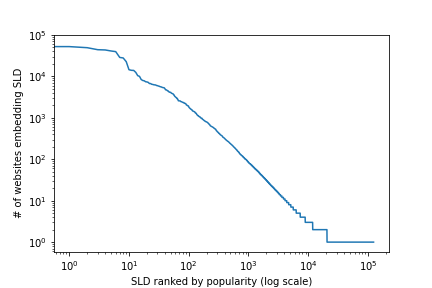

# List of Popular Third Parties

This directory contains the list of all third party domains which are 
included on at least 1.000 websites in the Tranco 100k.

As an interesting side observation, the number of embeds and the popularity 
rank of a particular domain follow a power law distribution:

79% of domains in the 100k (88% of domains in the Tranco 10k) embed at least one third party.
Setting a lower threshold does not meaningfully change results; if we set the threshold to only 10 websites (instead of 1.000), we count 4079 popular third parties, but still only 82% of domains embed at least one third party.
As such, we have chosen a very conservative threshold to err on the side of undercounting third parties.

# Service Domains

We use the following domains do determine the presence of a particular service:

 - **Google Ads:** `doubleclick.net`, `googleadservices.com`, `googlesyndication.com`
 - **Google Tracking:** `google-analytics.com`, `googletagmanager.com`, `googletagservices.com`
 - **QuantCast:** `quantcast.mgr.consensu.org`
 - **OneTrust:** `cdn.cookielaw.org`
